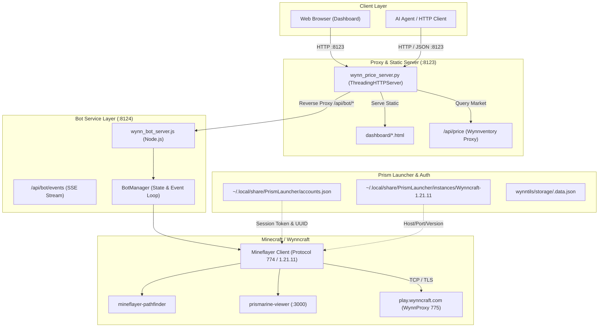

# Agent Guide & API Reference: Wynncraft Mineflayer Setup

This document provides technical instructions, architecture diagrams, API schemas, and programmatic recipes for **AI coding agents** and **automated systems** interacting with the Wynncraft Quick Launch and Mineflayer bot environment.

---

## 1. System Architecture



---

## 2. Ports & Endpoints Overview

| Service | Port | Host | Protocol | Managed By |
|---|---|---|---|---|
| Main Dashboard & Reverse Proxy | `8123` | `localhost` | HTTP / JSON | `scripts/wynn_price_server.py` |
| Bot Control & Events API | `8124` | `localhost` | HTTP / SSE | `scripts/wynn_bot_server.js` |
| 3D Web Visualizer | `3000` | `localhost` | HTTP / WS | `prismarine-viewer` |

> [!NOTE]
> All `/api/bot/*` requests sent to `http://localhost:8123` are automatically forwarded to `http://localhost:8124`. Agents only need to speak to `http://localhost:8123`.

---

## 3. REST API Specification

### `GET /api/bot/status`
Returns full connection status, vitals, position, and Prism account info.

**Response `200 OK`**:
```json
{
  "connected": true,
  "status": "connected",
  "statusMessage": "Spawned in Wynncraft",
  "username": "boredfrom0",
  "health": 20,
  "maxHealth": 20,
  "food": 20,
  "position": { "x": 470.2, "y": 67.0, "z": -1575.8, "yaw": -0.12, "pitch": 0.05 },
  "server": "WC3",
  "availableCharacters": [],
  "antiAfk": true,
  "viewerActive": true,
  "viewerUrl": "http://localhost:3000",
  "emeralds": {
    "total": 4234,
    "le": 1,
    "eb": 2,
    "e": 10,
    "formatted": "1 LE, 2 EB, 10 E"
  },
  "prism": {
    "instance": "Wynncraft-1.21.11",
    "minecraftVersion": "1.21.11",
    "host": "play.wynncraft.com",
    "port": 25565,
    "account": {
      "name": "boredfrom0",
      "uuid": "8aee6d8bf7e344b0a8b033ca18aed57b",
      "type": "MSA",
      "isTokenValid": true,
      "validMinutesRemaining": 940
    }
  }
}
```

---

### `POST /api/bot/connect`
Initiates connection to Wynncraft using cached Prism credentials.

**Request Body**:
```json
{
  "instance": "Wynncraft-1.21.11",
  "auth": "prism",
  "characterSlot": "1",
  "antiAfk": true,
  "viewer": true
}
```
* `characterSlot`: (optional) slot number `"1"` - `"5"` or class name `"archer"`, `"warrior"`, `"mage"`, `"assassin"`, `"shaman"`.
* `antiAfk`: (optional) boolean, default `true`.
* `viewer`: (optional) boolean, default `false`.

**Response `200 OK`**:
```json
{ "ok": true, "status": "connecting" }
```

---

### `POST /api/bot/disconnect`
Gracefully disconnects the bot.

**Response `200 OK`**:
```json
{ "ok": true }
```

---

### `POST /api/bot/chat`
Sends a chat message or in-game command.

**Request Body**:
```json
{ "message": "/hub" }
```

**Response `200 OK`**:
```json
{ "ok": true }
```

---

### `POST /api/bot/goto`
Commands the bot to pathfind to target 3D coordinates.

**Request Body**:
```json
{ "x": 470, "y": 67, "z": -1575 }
```

**Response `200 OK`**:
```json
{ "ok": true }
```

---

### `POST /api/bot/stop`
Cancels active pathfinding navigation.

**Response `200 OK`**:
```json
{ "ok": true }
```

---

### `POST /api/bot/class`
Selects a character from the `/class` selection menu or manually clicks an exact container slot/pane index.

**Request Body**:
```json
{
  "slotOrClass": "raw:1",
  "rawSlot": true
}
```
* `slotOrClass`: `"first"`, character card number (`"1"`-`"6"`), class name (`"mage"`, `"archer"`), or exact container slot index (`"raw:1"`, `"pane:0"`).
* `rawSlot`: Optional boolean to treat numeric inputs as raw container slots (e.g. `slotOrClass: 1, rawSlot: true` clicks container slot index 1, a glass pane).

---

### `POST /api/bot/server`
Switches worlds on Wynncraft.

**Request Body**:
```json
{ "server": "5" }
```
* `"5"` switches to `WC5`.
* `"hub"` switches to `Hub`.

---

### `POST /api/bot/antiafk`
Toggles anti-AFK movements.

**Request Body**:
```json
{ "enabled": true }
```

---

### `GET /api/bot/window`
Returns structured details of the currently open container window or player inventory ("E"), including decorative glass panes, character cards, and slot indices.

**Response `200 OK`**:
```json
{
  "open": true,
  "id": 1,
  "type": "minecraft:generic_9x6",
  "title": "Character Selection",
  "totalSlots": 54,
  "slots": [
    { "slot": 0, "empty": false, "name": "gray_stained_glass_pane", "count": 1, "isGlassPane": true, "isCharacterSlot": false },
    { "slot": 9, "empty": false, "name": "bow", "count": 1, "customName": "Archer (Level 59)", "isGlassPane": false, "isCharacterSlot": true, "lore": ["Class: Archer", "Level: 59"] }
  ]
}
```

---

### `POST /api/bot/click`
Clicks a specific slot in the currently open container or player inventory.

**Request Body**:
```json
{
  "slot": 9,
  "button": 0,
  "mode": 0
}
```
* `slot`: 0-indexed container/inventory slot number.
* `button`: `0` for Left-Click, `1` for Right-Click.
* `mode`: `0` for Normal Click, `1` for Shift-Click.

---

### `POST /api/bot/autolock`
Configures or toggles automatic class selection upon entering the Wynncraft character lobby or opening the character selection container. Supports manual slot and decorative pane override.

**Request Body**:
```json
{
  "enabled": true,
  "characterTarget": "raw:1",
  "manualOverride": true
}
```
* `enabled`: boolean (`true` / `false`).
* `characterTarget`:
  * `"first"`: Automatically discovers and clicks the first available character card.
  * `"1"` - `"6"`: Targets 1-indexed character cards (which map to container slots 9, 10, 11, 18, 19, 20...).
  * `"archer"`, `"warrior"`, `"mage"`, `"assassin"`, `"shaman"`: Discovers character cards by class archetype name or lore.
  * `"raw:N"` (e.g. `"raw:1"`, `"raw:0"`): **Manual Override** targeting exact raw container slot or glass pane index `N` (0–53) directly, bypassing card slot remapping.
* `manualOverride`: boolean (`true` / `false`). When `true`, pauses automatic character card clicking, allowing manual pane/slot manipulation.

### `POST /api/bot/action`
Executes physical client actions or lobby interaction hitbox clicks in Wynncraft 2.0+.
In the Character Selection Lobby, Wynncraft streams `Left-Click to play | Right-Click to switch` with an `interaction` entity positioned directly in front of the player. This endpoint targets the interaction hitbox or performs physical player gestures.

**Request Body**:
```json
{
  "action": "left_click"
}
```
* `action`:
  * `"left_click"` / `"play"` / `"attack"` / `"swing"`: Attacks the lobby interaction entity or swings arm. In Wynncraft 2.0+ lobby, this selects the active character and enters the game world.
  * `"right_click"` / `"switch"` / `"activate"` / `"use"`: Interacts with the lobby interaction entity or activates held item. In Wynncraft 2.0+ lobby, this opens the 54-slot Character Selection container window.
  * `"sneak"`: Toggles crouching/sneaking (Shift key) for 350ms.
  * `"jump"`: Triggers player jump for 350ms.
  * `"open_class"` / `"class"`: Interacts with lobby hitbox or runs `/class` to open the character selection container GUI.

**Response `200 OK`**:
```json
{ "ok": true, "action": "left_click" }
```

---

### `GET /api/bot/entities`
Returns all nearby entities tracked by the client, including players, armor stands, item displays, and Wynncraft 2.0+ `interaction` hitboxes.

**Response `200 OK`**:
```json
{
  "entities": [
    {
      "id": 12454843,
      "name": "interaction",
      "type": "other",
      "distance": 1.5,
      "position": { "x": 18370.9, "y": 25.5, "z": -880.4 }
    }
  ]
}
```

---

### `POST /api/bot/open_inventory`
Retrieves player inventory (window ID 0) as a structured window.

---

### `POST /api/bot/close_window`
Closes the active container window (equivalent to pressing ESC).

---

### `GET /api/bot/poll?since=<id>`
Fetches status and any new chat/dialogue messages with ID greater than `since`.

**Response `200 OK`**:
```json
{
  "status": { ... },
  "messages": [
    {
      "id": 14,
      "time": "10:15:32 AM",
      "type": "dialogue",
      "sender": "Bob",
      "text": "Traveler! Welcome to Ragni.",
      "raw": "Bob: Traveler! Welcome to Ragni."
    }
  ]
}
```

---

### `GET /api/bot/waypoints`
Returns pre-configured city and POI coordinate markers.

---

### `GET /api/price?item=<name>`
Looks up Trade Market pricing via the Wynnventory proxy.

**Response `200 OK`**:
```json
{
  "name": "Gale's Sight",
  "lowest_price": 4096,
  "highest_price": 16384,
  "average_price": 8192,
  "total_count": 24
}
```

---

### Shared state (`GET /api/state`, port 8123)

One cheap snapshot every dashboard page reads, so the same information means
the same thing on all of them:

```json
{
  "ok": true, "ts": 1758291234.5,
  "services": { "botServer": true, "priceApi": true },
  "bot":     { "connected": true, "position": {...}, "viewer": {...}, "window": {...} },
  "account": { "using": {...}, "locked": true, "prismActive": {...} },
  "market":  { "open": true, "listingCount": 12, "cheapest": { "spring": { "price": 9000, "slot": 11 } } },
  "engine":  { "modelLoaded": true, "strategy": {...}, "marketFee": 0.05 },
  "prices":  { "watchlist": [...], "historyItems": [...] }
}
```

It only reads local files and the local bot server - anything that would call
Wynnventory stays on its own on-demand endpoint (`/api/price`, `/api/deltas`,
`/api/plan`). With the bot server stopped, `bot` and `market` come back `null`
and `services.botServer` is `false`; the rest still answers.

`market.cheapest` is the join key between the three data sources: the lowest
live in-game ask per item, which `/api/deltas` prefers over Wynnventory's
lowest listing and over the last recorded price. `WYNN_BOT_SERVER_URL` (or
`WYNN_BOT_PORT`) points the dashboard at a bot server elsewhere.

Browser side, `dashboard/wynn-client.js` wraps this: `WynnClient.subscribe(fn)`
for the snapshot, `getSelection()`/`setSelection()` for the item that travels
between pages (URL first, then localStorage), `linkTo(page, selection)` and
`crossLinks(item)` for the links, and the shared `formatEmeralds` /
`parseEmeralds` / `percent` / `escapeHtml` formatters.

### Account lock (`/api/bot/accounts`, `/api/bot/account/*`)

| Method | Path | Body | Effect |
|---|---|---|---|
| `GET` | `/api/bot/accounts` | - | Every Prism account with `prismActive`, `usedByBot`, token validity, plus the active lock and its file |
| `POST` | `/api/bot/account/lock` | `{ account }` (name or UUID) | Pins the bot to that account regardless of which one Prism has active |
| `POST` | `/api/bot/account/unlock` | - | Releases the lock; the bot follows Prism again |

`GET /api/bot/status` carries the same picture under `account`: `using`,
`source` (`lock` \| `env` \| `prism-active` \| `prism-first`), `prismActive`,
`followsPrism`, `sameAsPrismActive` and `warnings`.

The lock exists so you can switch accounts in Prism - to watch the bot from
inside the game on a second account - without the web server switching with
it. It is stored outside Prism's files and changing it affects the next
connect, never a running session.

### Trade Market (`/api/bot/market*`, port 8124 or proxied via 8123)

| Method | Path | Body | Effect |
|---|---|---|---|
| `GET` | `/api/bot/market` | - | Parsed market window: `listings`, `controls`, `slots`, `page`, `distance`, `locations` |
| `POST` | `/api/bot/market/walk` | `{ location }` | Pathfinds to a market location (`detlas`, `llevigar`, `cinfras`, or `{x,y,z}`) |
| `POST` | `/api/bot/market/open` | `{ location, walk }` | Walks (unless `walk:false`), interacts with the NPC, waits for the window |
| `POST` | `/api/bot/market/close` | - | Closes the container |
| `POST` | `/api/bot/market/search` | `{ query }` | Clicks the search pane and answers the chat prompt |
| `POST` | `/api/bot/market/next_page` / `prev_page` | - | Pagination controls |
| `POST` | `/api/bot/market/click` | `{ slot \| role \| name, confirm }` | Clicks a pane; listings require `confirm: true` |
| `POST` | `/api/bot/market/buy` | `{ slot, confirm: true, maxPrice }` | Buys a listing, refusing above the ceiling |

Every action also pushes a `market` event on `/api/bot/events` (SSE).

> [!WARNING]
> `click` on a listing and `buy` spend real in-game emeralds and cannot be undone. Both refuse without `confirm: true`.

### Trade engine (`/api/deltas`, `/api/plan`, `/api/model/*`, `/api/evolve`, port 8123)

| Method | Path | Query | Returns |
|---|---|---|---|
| `GET` | `/api/deltas` | `items`, `days`, `live` | Per-item edge: `ask`, `fair_value`, `delta`, `roi`, `hold_days`, `score`, `source` |
| `GET` | `/api/plan` | `items`, `capital`, `slots`, `days` | Capital allocation across sell slots: `legs`, `capital_deployed`, `expected_profit`, `turnover_days` |
| `GET` | `/api/model/train` | `items`, `horizon`, `epochs`, `hidden` | Trains the forward-return net on walk-forward samples; refuses under 20 samples |
| `GET` | `/api/model/status` | - | Model shape, feature names, active strategy and its bounds |
| `GET` | `/api/evolve` | `generations`, `population`, `capital`, `slots`, `save` | Genetic search over strategy parameters, scored by walk-forward backtest |

`source` says which data the ask came from: `live_listing` (the bot's open market
window), `wynnventory` (upstream aggregate), or `local_history` (last recorded
price, i.e. stale). Implementation: `scripts/wynn_trade_engine.py`.

---

## 4. Programmatic Node.js API (`mineflayer-wynn`)

Agents working inside Node.js scripts can require `mineflayer-wynn` directly:

```javascript
const {
  createWynnBot,
  getWynnInstance,
  getPrismAccounts,
  getActiveAccount,
  getWynntilsData,
  stripFormatting
} = require('mineflayer-wynn');

// 1. Inspect account validity
const account = getActiveAccount();
if (!account.isTokenValid) {
  throw new Error('Prism session token has expired. Launch Prism Launcher to refresh.');
}

// 2. Launch bot
const { bot, prismInstance } = createWynnBot({
  instance: 'Wynncraft-1.21.11',
  auth: 'prism',
  character: 'archer',
  antiAfk: true,
  viewer: 3000
});

// 3. Handle Wynncraft events
bot.on('wynn:dialogue', (d) => {
  console.log(`NPC ${d.npc} said: ${d.speech}`);
});

bot.on('wynn:quest', (q) => {
  console.log(`Quest update: ${q}`);
});

bot.on('spawn', () => {
  console.log('Bot in world, coordinates:', bot.entity.position);
});
```

---

## 5. Agent Workflow Recipes

### Recipe A: Health & Token Verification (Curl)
```bash
curl -s http://localhost:8123/api/bot/status | jq '.prism.account'
```

### Recipe B: Connect Bot and Select Class via API
```bash
curl -s -X POST http://localhost:8123/api/bot/connect \
  -H "Content-Type: application/json" \
  -d '{"characterSlot": "warrior", "antiAfk": true, "viewer": true}'
```

### Recipe C: Navigate to Detlas Trade Market
```bash
# Detlas Market coordinates: 528, 68, -1600
curl -s -X POST http://localhost:8123/api/bot/goto \
  -H "Content-Type: application/json" \
  -d '{"x": 528, "y": 68, "z": -1600}'
```

### Recipe D: Query Item Price Before Trading
```bash
curl -s "http://localhost:8123/api/price?item=Mithril%20Leggings" | jq .
```

---

## 6. Directory Structure & Key Paths

```
/home/shubcache/
├── .local/share/PrismLauncher/
│   ├── accounts.json                     # Microsoft auth tokens & UUIDs
│   └── instances/Wynncraft-1.21.11/      # Prism Minecraft instance
│       ├── instance.cfg                  # Host & auto-join settings
│       ├── mmc-pack.json                 # MC 1.21.11 + Fabric version
│       └── minecraft/wynntils/storage/   # Wynntils player cache
├── wynncraft-quicklaunch/                # Git repo: Shubin123/wynncraft-quicklaunch
│   ├── dashboard/
│   │   ├── index.html                    # Price lookup page
│   │   ├── predict.html                  # Trend / regression page
│   │   ├── optimize.html                 # Sell slot optimizer
│   │   └── bot.html                      # Bot Controller Web App
│   ├── docs/
│   │   ├── GETTING_STARTED.md            # Human guide
│   │   └── AGENT_GUIDE.md                # This agent specification
│   └── scripts/
│       ├── wynn_price_server.py          # Port 8123 HTTP server + reverse proxy
│       ├── wynn_bot_server.js            # Port 8124 Node.js Bot API service
│       └── launch_mineflayer.sh          # Terminal bot launcher
└── mineflayer-wynn/                      # Core Node.js library
    ├── bin/mineflayer-wynn.js            # CLI executable
    ├── src/
    │   ├── prism.js                      # Prism Launcher parser & auth handler
    │   ├── wynncraft.js                  # Wynncraft plugin & chat parser
    │   ├── bot.js                        # Mineflayer bot factory
    │   ├── repl.js                       # Interactive REPL
    │   └── viewer.js                     # 3D visualizer loader
    └── tests/                            # Unit tests
```
